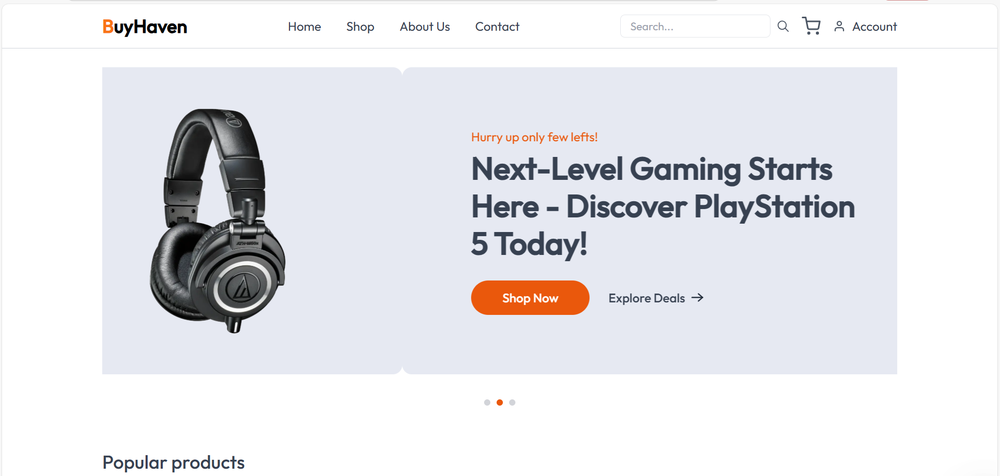
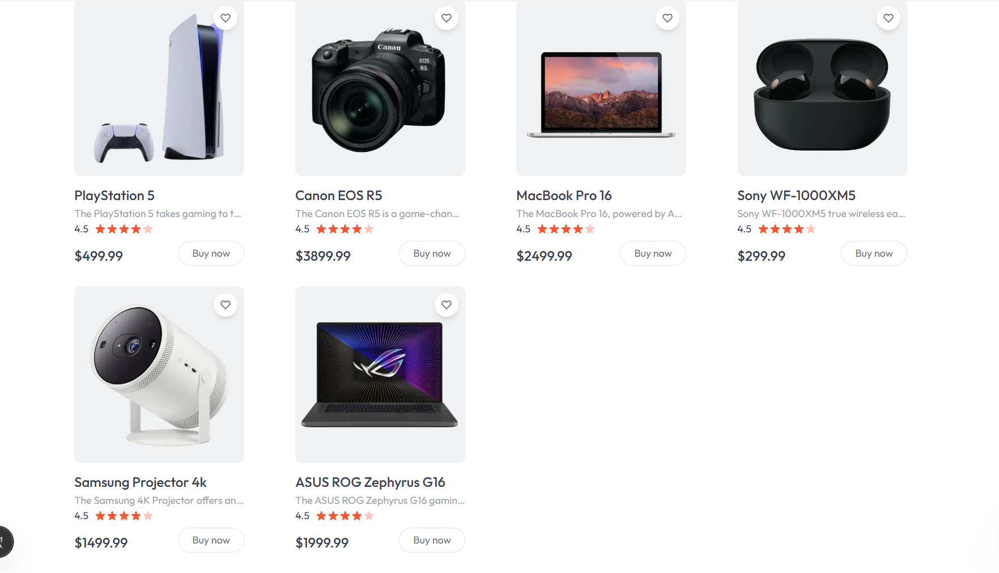
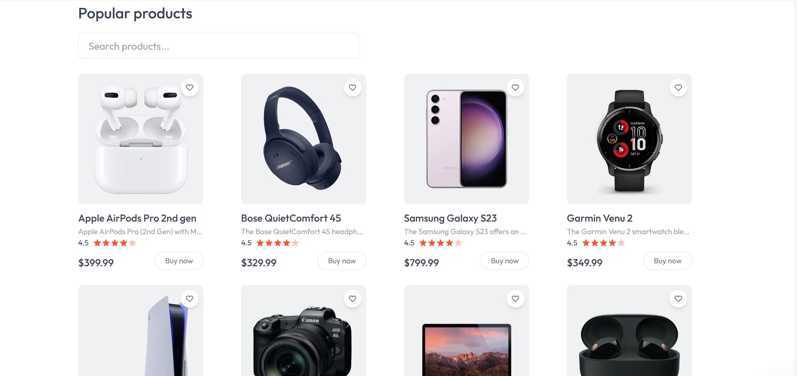

BuyHaven is a fully functional e-commerce website built using **Next.js 15**, **Tailwind CSS**, **MongoDB**, and **Node.js**.  
It provides users with a seamless shopping experience and a responsive, clean UI.
This is a [Next.js](https://nextjs.org) project bootstrapped with [`create-next-app`]
## Getting Started

First, run the development server:

```bash
npm run dev
# or
yarn dev
# or
pnpm dev
# or
bun dev
```

Open [http://localhost:3000](http://localhost:3000) with your browser to see the result.

You can start editing the page by modifying `app/page.js`. The page auto-updates as you edit the file.

This project uses [`next/font`](https://nextjs.org/docs/app/building-your-application/optimizing/fonts) to automatically optimize and load (https://vercel.com/font), a new font family for Vercel.

## Learn More

To learn more about Next.js, take a look at the following resources:

- [Next.js Documentation](https://nextjs.org/docs) - learn about Next.js features and API.
- [Learn Next.js](https://nextjs.org/learn) - an interactive Next.js tutorial.


## Deploy on Vercel

The easiest way to deploy your Next.js app is to use the [Vercel Platform](https://vercel.com/new?utm_medium=default-template&filter=next.js&utm_source=create-next-app&utm_campaign=create-next-app-readme) from the creators of Next.js.


## 📸 Screenshots

### 🏠 Home Page


### 🛒 Product Listing


### 🧾 Product Details


### 🧍‍♂️ Seller Dashboard


### 📧 Newsletter Section


